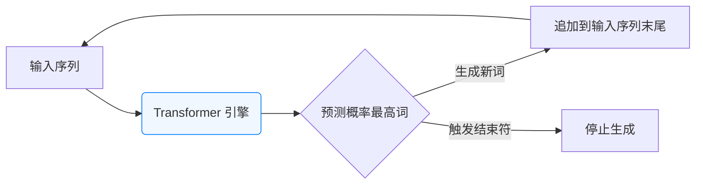
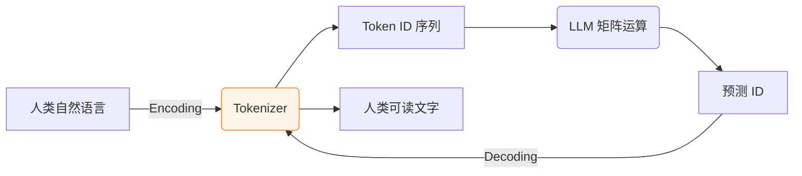
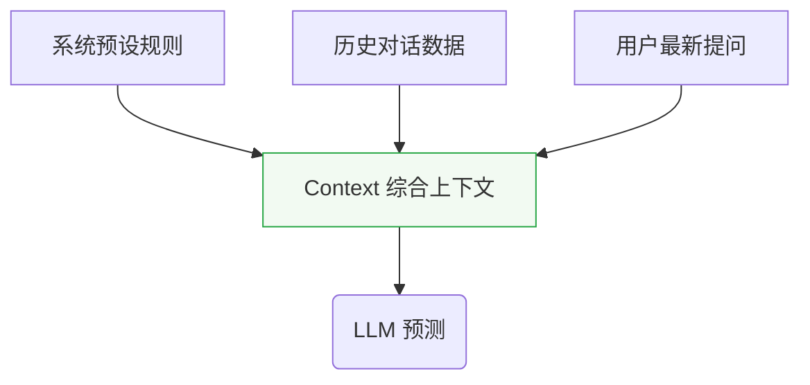
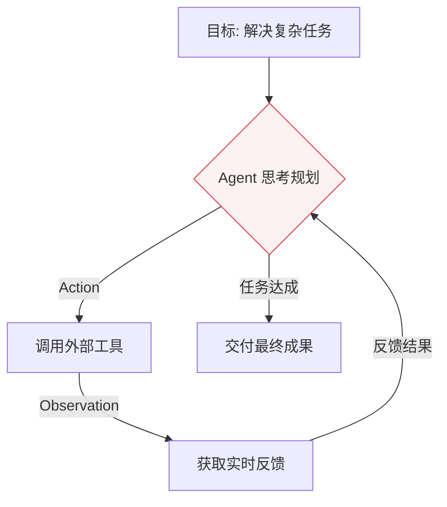
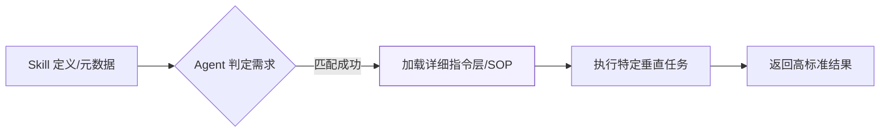

# 深度解析：从 LLM 到 Agent Skill 的全链路底层逻辑

这不仅是一份技术笔记，更是一份关于 AI 智能进化的工程指南。我们将自下而上，从最微小的 Token 出发，一直探索到具备自主灵魂的 Agent Skill。

## 1. LLM (大语言模型)：本质是数学驱动的“文字接龙”

大模型（Large Language Model）的核心引擎是 **Transformer** 架构。尽管它的内部数学逻辑极其复杂，但在表现层，它只做一件事：根据前文预测下一个词。

* **生成逻辑**：它是一个概率预测模型。当你输入一段话，它会计算出后面可能出现的成千上万个词的概率，并挑出最高的一个。
* **递归特性**：每生成一个新词，这个词就会被**立即追加**到之前的输入中，形成一段更长的“前文”，再进行下一次预测。这种“吞噬自己输出”的过程，就是大模型能够生成长篇大论的原因。



## 2. Token & Tokenizer：数字世界与人类语言的握手

大模型并不直接“阅读”文字，它只能处理由 0 和 1 组成的向量（矩阵）。

* **Tokenizer (分词器)**：它是连接人类思维与机器计算的翻译中介。
    * **编码 (Encoding)**：将文字切碎成 Token（片段），并转换为对应的 Token ID（数字）。
    * **解码 (Decoding)**：将模型计算出的数字还原为文字。
* **关键理解**：Token 并不是词组，也不是单词。一个汉字可能对应多个 Token，一个复杂的英文单词也可能被拆分。它是模型能够处理的**最小语义单元**。



## 3. Context & Memory：依靠“堆叠”实现的伪记忆

大模型本质上是“无状态”的。它不像人类那样拥有持久的生物大脑记忆，它对“之前聊了什么”的感知完全依赖于 **Context (上下文)**。

* **记忆的假象**：之所以你能跟它多轮对话，是因为背后的程序每次都会悄悄把**你们之前的全部聊天记录**重新打包，作为新的输入发给模型。
* **Context Window (上下文窗口)**：这是大模型的“短期记忆极限”。一旦对话太长，超过了模型能处理的 Token 上限，它就会被迫“裁剪”掉最早的记忆，从而导致它表现出“健忘”。



## 4. Prompt 工程：System 与 User 的协同

Prompt（提示词）不再仅仅是“提问”，它是一种对模型行为的**约束规范**。

* **System Prompt (系统提示词)**：它是开发者的“圣旨”。它在后台运行，定义了模型的身份（如：你是一个严谨的代码审查官）和禁止事项。
* **User Prompt (用户提示词)**：是用户下达的具体任务指令。
* **协同机制**：System Prompt 决定了模型的“性格”和“下限”，User Prompt 决定了任务的“内容”和“上限”。

## 5. Tool & MCP：打破大模型的“信息孤岛”

LLM 最大的痛点是无法实时联网且计算能力有限。

* **Tool (外部工具)**：是给大模型插上的“手”和“眼”。模型通过输出一段特定的格式（如 JSON），告诉平台“我需要调用天气接口”或“我需要计算这个公式”。
* **MCP (Model Context Protocol)**：这是一种行业标准协议。它统一了工具的接入方式。有了 MCP，开发者只需要写一次搜索工具或数据库插件，就可以在 Claude、GPT、Gemini 等所有支持该协议的模型中使用，极大降低了生态开发的成本。

## 6. Agent (智能体)：从“被动响应”到“主动规划”

Agent 是 AI 进化的终极形态之一。它不再只是“问答机器人”，而是一个能够**独立完成任务的数字员工**。

* **核心闭环 (ReAct)**：Agent 的核心是“思考 (Thought) -> 行动 (Action) -> 观察结果 (Observation)”。
* **自主性**：当你给 Agent 一个模糊目标（如：帮我调研并订一张去上海最划算的机票），它会自己拆解步骤、查价格、比对时间、处理退改签规则，直到任务完成。



## 7. Agent Skill：给智能体的“高阶技能包”

为了让 Agent 在特定领域更专业（比如：只按你的审美写代码，或按你的习惯安排日程），我们需要 **Agent Skill**。

* **定义层**：描述这个技能是做什么的（Name & Description），方便 Agent 在需要时快速检索。
* **指令层**：包含详细的执行 SOP（标准作业程序）、判断逻辑、输出范例。
* **渐进式披露**：为了节省昂贵的 Token，Agent 会先阅读技能描述。只有当它确定需要这个技能时，才会去加载详细的文档。这就像是给 Agent 配备了一个随时可查阅的“专家操作手册”。



***

## 8. MCP (Model Context Protocol)：AI 界的“USB 接口协议”

在原笔记的基础上，**MCP** 是解决大模型与外部数据断层的关键标准。

- **统一协议**：此前不同 AI 助手调用工具的方式各异，开发者需重复开发；MCP 统一了工具接入方式，实现了一次编写、随处使用。
    
- **架构组成**：
    
    - **MCP Host**：大模型客户端（如 Claude Desktop 或 IDE），作为协议的宿主。
        
    - **MCP Server**：具体能力的提供者，负责读取本地文件、查询数据库或调用 API。
        
- **核心价值**：极大降低了 **Tool Calling** 的生态开发成本，让 AI 能够安全、标准地访问本地及远程数据。
    

---

## 9. RAG (检索增强生成)：给大模型的“开卷考试”

**RAG (Retrieval-Augmented Generation)** 是解决模型“幻觉”和知识滞后性的核心方案。

- **检索 (Retrieve)**：当用户提问时，系统先从向量数据库或私有文档中搜索相关的知识片段。
    
- **增强 (Augment)**：将搜索到的实时或私有信息与用户初始提示词合并，形成更丰富的 Context（上下文）。
    
- **生成 (Generate)**：模型基于这些“参考资料”进行回答，而非仅仅依靠权重中的记忆。
    
- **主要作用**：通过引入外部知识库，让 LLM 具备处理垂直领域私有数据和实时信息的能力。
    

---

## 10. CLI (命令行界面)：AI 驱动的自动化入口

**CLI (Command Line Interface)** 是开发者与 AI 进行高频、工程化协作的高速通道。

- **交互媒介**：与网页端（Web）的对话框不同，CLI 允许用户在终端通过指令直接与 LLM 或 Agent 交互。
    
- **自动化集成**：CLI 方便将 AI 能力集成到现有的工作流（如 Git 提交、自动化部署脚本）中。
    
- **环境感知**：AI 驱动的 CLI 工具可以直接访问当前操作系统的文件路径、运行环境和系统日志，是构建 **Agent Skill** 自动流的基础环境。
    

代码段

```
graph LR
    A[用户指令] --> B(CLI 终端界面)
    B --> C{调用模型/MCP Server}
    C --> D[执行系统操作/代码运行]
    D --> B
    style B fill:#e9ecef,stroke:#343a40
```
**视频参考来源：**
[从 LLM 到 Agent Skill，一期视频带你打通底层逻辑！](http://www.youtube.com/watch?v=7qO8-kx3gW8)